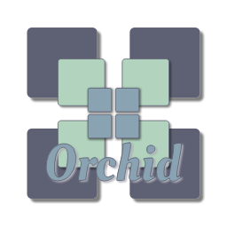

    

    
    
    
    
<!--
    
  -->

# `orchid` - Kubernetes inspired Object Store

`orchid` is an experiment on building a **Kubernetes inspired Object Store**, offering an equivalent 
of Kubernetes *CustomResourceDefinition* as basic primitive and using Postgres to store user defined 
resources. Postgres will not only be responsible for managing CRUD operations related to those 
resources but, more importantly, a transactional engine that can be used to leverage a transactional 
API yet to be defined.

As a design goal, `orchid` should support user interactions through `kubectl`; this is important to
leverage already existing knowledge and tooling.

It is expected that any serious implementation might require a work group or SIG to be formed in 
order to coordinate the development of shared components used by this project and Kubernetes, in the 
case `orchid` catches the community's attention.
